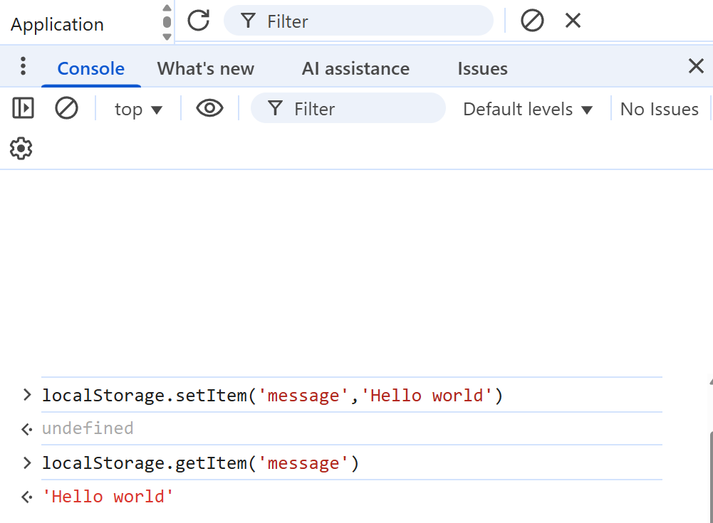
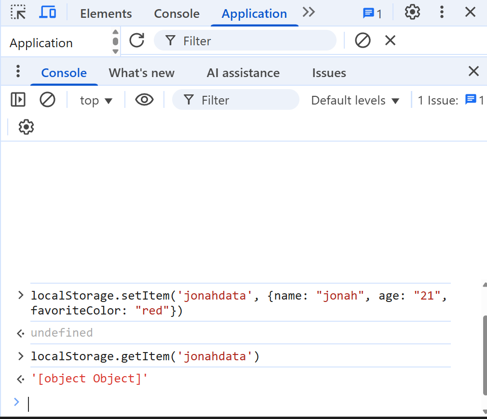
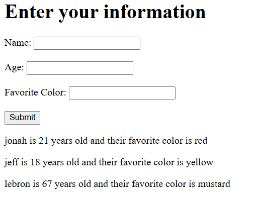

# How to Store, Access, and Display JSON Data in Browser Local Storage
Jonah Abbott
17 October 2025

### Introduction
In this tutorial we will learn what JSON is and how to use it in localStorage through JavaScript. We will be using a basic HTML form with embedded JavaScript to store, access, and display JSON data. By the end of the walkthrough, you will know how to work with JSON objects in localStorage and why it's important.

### Why do we need JSON?
JSON, or JavaScript Object Notation, is a data representation format. In web development, data is constantly being transferred between the browser and the server. JSON provides an easy-to-read format of this data that works seamlessly between a web server and the browser. JSON is commonly used with APIs and config files and can store data types such as strings, numbers, Booleans, arrays, and objects. Almost all programming languages have libraries to parse json strings into objects in that programming language, making JSON extremely accessible and simple to use! Here is an example of a data object in .JSON format:

```json
[
  {
    "name": "jonah",
    "age": "21",
    "favoriteColor": "red"
  }
]
```
This JSON string holds a few keys and their values. We will go more into depth on how this can be useful, but know that the most commonly used JSON data type is an object. To demonstrate how to use JSON, we’ll create a simple website that collects a user’s information, converts it into a JavaScript object, saves it as a JSON string in localStorage, and then displays it on the page.

Start by creating a basic HTML page with a form that takes a few parameters. I used name, age, and favorite color. These inputs will be the JavaScript object we store in our JSON data. 

```html
<!DOCTYPE html>
<html lang="en">
<head>
    <meta charset="UTF-8">
    <meta name="viewport" content="width=device-width, initial-scale=1.0">
    <title>My Website</title>
</head>
<body>
    <h1>Enter your information</h1>
    <form id="userForm">
        <label for="name">Name:</label>
        <input type="text" id="name" name="name" required><br><br>
        
        <label for="age">Age:</label>
        <input type="text" id="age" name="age" required><br><br>
        
        <label for="color">Favorite Color:</label>
        <input type="text" id="color" name="color" required><br><br>
        
        <button type="submit">Submit</button>
    </form>

    <div id="userList"></div>
</body>
</html>
```

We can convert this form data to an object in JavaScript with the following code: 

```JavaScript
const userData = {
                name: document.getElementById('name').value,
                age: document.getElementById('age').value,
                favoriteColor: document.getElementById('color').value
            };
```
Now we are ready to save the object to localStorage. localStorage is browser based persistent storage. It is important to note that storage saved in localStorage is domain-specific, meaning data stored in one website in inaccessible from a different website. localStorage always converts the data into a string. 

For example, this is how you would save and then display a localStorage string, "hello world":


This works fine for a single string data type, however when we try entering in our JSON data, we get this error:

This happens because localStorage can only store strings. If you try to save JSON data directly, it won’t show up correctly since it’s not in string format. To fix this, the correct way to store JSON data in localStorage is using `JSON.stringify()`. Here is the updated JavaScript section of our HTML file, with the code embedded inside `<script></script>` tags. In my file I have the JavaScript directly in the `body` tag underneath the form.

```javascript
    <script>
        document.getElementById('userForm').addEventListener('submit', function() {
            // creates JSON:   {name: "jonah", age: "21", favoriteColor: "red"}
            const userData = {
                name: document.getElementById('name').value,
                age: document.getElementById('age').value,
                favoriteColor: document.getElementById('color').value
        };
        });
    </script>
```
Now that we know how to correctly store and access JSON data within our localStorage, we will now display the JSON data that is stored on the localStorage of our website. To retrieve JSON data and store it into an object variable, we use this line of code:
```javascript
//retrieves existing JSON object and stored to the variable 'data'
let data = JSON.parse(localStorage.getItem('userData')) || [];

// Add new user data
data.push(userData);

// Save to localStorage
localStorage.setItem('userData', JSON.stringify(data));
```
Lets break this line of code down. `JSON.parse()` is the function that converts a JSON string back into a Javascript object. Inside `JSON.parse()`, `localStorage.getItem('userData')` is how we access the user data string from our localStorage. You may be asking what the `|| []` at the end is doing. This means that if `localStorage.getItem()` fails(returns nothing), it will set data to an empty array instead of causing an error. `data.push(userData)` adds the new object to the array `data`. We then save the updated data array to the localStorage.

The last step in displaying our user data, is to loop through array `data` and print out the values in a human-readable string. This can be done by creating a new Javascript function that loops through the array and prints it out in the HTML:

```javascript
function displayUsers() {
    // Get the HTML element where we’ll display the list of users
    const userListDiv = document.getElementById('userList');

    // Retrieve user data from localStorage and parse it into an array of objects
    let users = JSON.parse(localStorage.getItem('userData')) || [];

    // Clear any existing content in the userList div before adding new entries
    userListDiv.innerHTML = '';

    // Loop through each user object in the array
    for (let i = 0; i < users.length; i++) {
        let person = users[i];

        // Create a descriptive message for each user
        let message = person.name + ' is ' + person.age + ' years old and their favorite color is ' + person.favoriteColor;

        // Create a new <p> element to hold the message
        let paragraph = document.createElement('p');
        paragraph.textContent = message;

        // Add the paragraph to the user list section of the page
        userListDiv.appendChild(paragraph);
    }
}
```
After calling `displayUsers()` at the end of the embedded JavaScript code, we are finished! The completed `<script>` tag will look like this:
```javascript
    <script>
        document.getElementById('userForm').addEventListener('submit', function() {
            event.preventDefault(); // Prevents the form from refreshing the page
            // creates JSON:   {name: "jonah", age: "21", favoriteColor: "red"}
            const userData = {
                name: document.getElementById('name').value,
                age: document.getElementById('age').value,
                favoriteColor: document.getElementById('color').value
            };

            // Get existing data from localStorage
            let data = JSON.parse(localStorage.getItem('userData')) || [];

            // Add new user data
            data.push(userData);

            // Save to localStorage
            localStorage.setItem('userData', JSON.stringify(data));

            alert('Data saved successfully!');
            this.reset();
            displayUsers();
        });

        // Function to display users from localStorage
        function displayUsers() {
            const userListDiv = document.getElementById('userList');
            let users = JSON.parse(localStorage.getItem('userData')) || [];
            userListDiv.innerHTML = '';
            for (let i = 0; i < users.length; i++) {
                let person = users[i];
                let message = person.name + ' is ' + person.age + ' years old and their favorite color is ' + person.favoriteColor;
                let paragraph = document.createElement('p');
                paragraph.textContent = message;
                userListDiv.appendChild(paragraph);
            }
        }

        // Show users on page load
        displayUsers();
    </script>
```
Here is the final page view after adding some data:


### Additional Resources:

Understanding JSON and localStorage in JavaScript - by Acadea.io https://www.youtube.com/watch?v=1vdEH2bX9QE - Explains storing and accessing JSON data in localStorage very simply

https://www.w3schools.com/js/js_json.asp - Great for code examples and learning syntax 

Learn JSON in 10 minutes
https://www.youtube.com/watch?v=iiADhChRriM - Great video on what JSON is, especially for beginners

https://developer.mozilla.org/en-US/docs/Web/API/Window/localStorage - Javascript API docs for localStorage() command, very detailed


